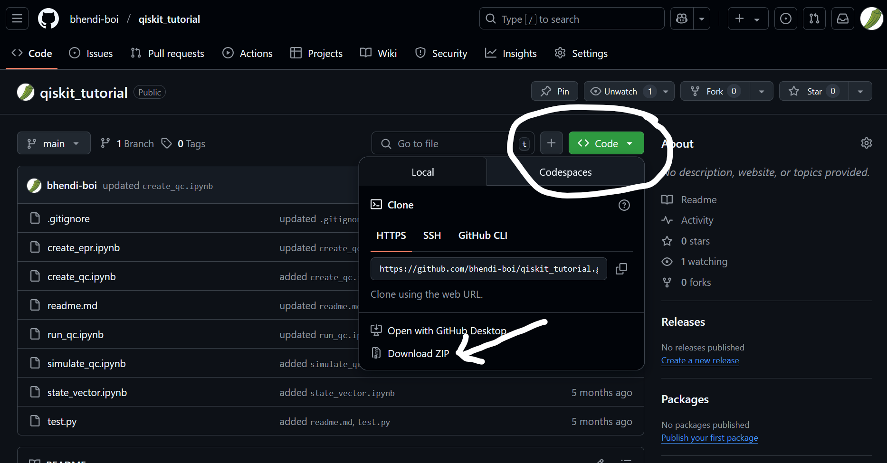
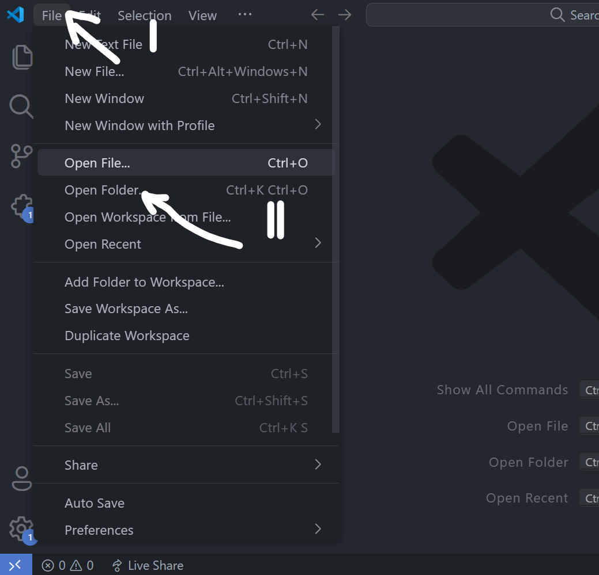
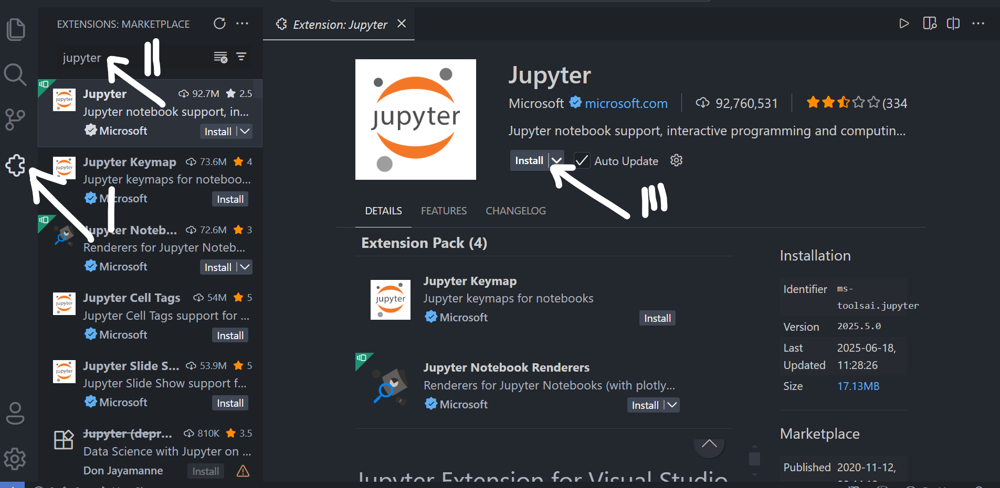
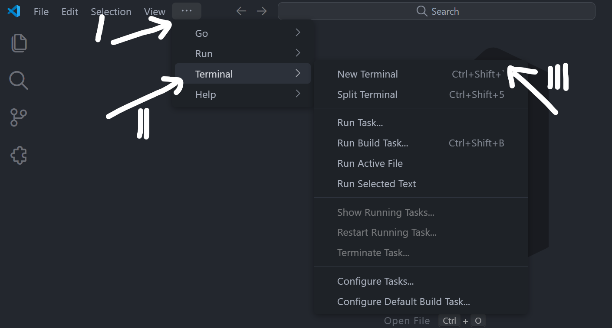
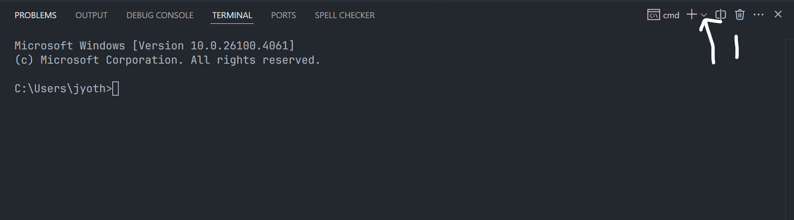
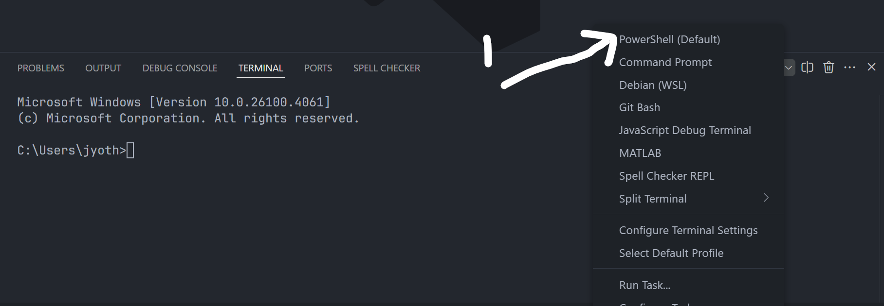
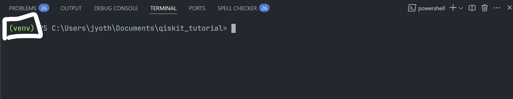
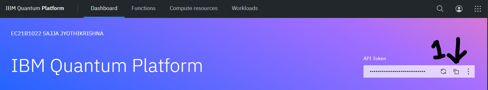

# Qiskit Tutorial

## Installation for this Tutorial

### Prerequsites

We recommend you do this before attending the session.

- Download [Python 3.x](https://www.python.org/downloads/) on your machine.
- Download this [github repo](https://github.com/bhendi-boi/qiskit_tutorial) by hitting the code button followed by download zip button.
  
- Unzip the folder and open it using a text editor or file explorer. We recommend you [download Visual Studio Code](https://code.visualstudio.com/download) and open this folder in VS Code.
  

- Finally, download Jupyter extension for VS Code.
  

### Installation

- Now we can download Qiskit and some addons
- Open the terminal in VS Code. You can also use the short hand `` Ctrl + Shift + `  ``.
  
- If it opens command prompt, change it to powershell.
  
  
- Once you have changed it to powershell, you will see `Powershell` instead of `cmd`.
- Create a python virtual environment and activate it. Refer to [this website](https://www.freecodecamp.org/news/how-to-setup-virtual-environments-in-python/) for more info.

If you run into any issues here, refer to [this website](https://superuser.com/questions/106360/how-to-enable-execution-of-powershell-scripts).

- After creating and activating a virtual environment, you will see something similar to this in your powershell window. DO NOT CLOSE THIS POWERSHELL WINDOW.
  

- Run this command in the same powershell window to start downloading required packages.

```
    pip install -r requirements.txt
```

### Check installation

- Run [test.py](test.py) file to check whether your installation is done perfectly. Run this command in the same powershell window to start downloading required packages.

```
    python test.py
```

- You should see output similar to this.

```bash
    Qiskit version =  1.3.1
    Qiskit IBM runtim version =  0.34.0
    Qiskit Aer version =  0.15.1
```

If you get this output, you are done with the installation.

## Create an IBM Account

- Visit [this website](https://quantum.ibm.com/) and create an account.
- Then, copy the API key and store it in file named secrets.txt in the present working folder.
  

Now you are ready for the session.

## Sample Notebooks

- After you are done with the installation, open you can open sample notebooks provided.
- [Create a Quantum circuit in qiskit](create_qc.ipynb)
- [Simulate a Quantum circuit in qiskit](simulate_qc.ipynb)
- [State Vectors in qiskit](state_vector.ipynb)
- [Run your ckts on IBM's QPUs](run_qc.ipynb)

## How to install Qiskit for new projects

- First, create a python virtual environment

```bash
    python -m venv venv_name
```

- Activate virtual environment

```bash
    venv_name/Scripts/Activate.ps1
```

- Install qiskit with visualisation features

```bash
    pip install qiskit[visualization]
```

- Install qiskit-ibm-runtime package

```bash
    pip install qiskit-ibm-runtime
```

- Install qiskit-aer package

```bash
    pip install qiskit-aer
```

- If you want to open your python notebooks using jupyter, install jupyter package as well.

```bash
    pip install jupyter
```

- If you are using a text editor like VSCode, install corresponding jupyter plugin. Here is the [link](https://marketplace.visualstudio.com/items?itemName=ms-toolsai.jupyter) for VSCode jupyter plugin.
